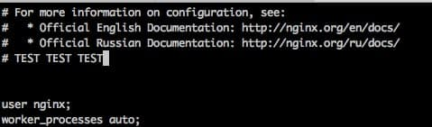

# Занятие 21. Сбор и анализ логов 

### Задание
```
Настраиваем центральный сервер для сбора логов
- в вагранте поднимаем 2 машины web и log на web поднимаем nginx на log настраиваем центральный лог сервер на любой системе на выбор
- journald
- rsyslog
- elk 
- настраиваем аудит следящий за изменением конфигов нжинкса
- все критичные логи с web должны собираться и локально и удаленно
- все логи с nginx должны уходить на удаленный сервер (локально только критичные)
- логи аудита должны также уходить на удаленную систему
* развернуть еще машину elk и таким образом настроить 2 центральных лог системы elk И какую либо еще в elk должны уходить только логи нжинкса во вторую систему все остальное
Критерии оценки:
Статус "Принято" ставится, если присылаете логи скриншоты без вагранта.
Задание со звездочкой выполняется по желанию.
```

## Решение

#### Поднято две машины - веб-сервер NGINX (web) и лог-сервер (log)

1. Проверяем работу критических логов

- на веб-сервере
>vagrant ssh web
```
Last login: Sat Jun 26 05:39:48 2021 from 10.0.2.2
-bash: warning: setlocale: LC_CTYPE: cannot change locale (ru_RU.UTF-8)
```
>[vagrant@web ~]$ logger -p crit this is critical error

>[vagrant@web ~]$ sudo grep web /var/log/messages | grep crit
```
Jun 26 05:40:20 web vagrant: this is critical error
```
>[vagrant@web ~]$ logout
```
Connection to 127.0.0.1 closed.
```

- на лог-сервере
>vagrant ssh log
```
Last login: Sat Jun 26 05:38:13 2021 from 10.0.2.2
-bash: warning: setlocale: LC_CTYPE: cannot change locale (ru_RU.UTF-8)
```
>[vagrant@log ~]$ sudo grep web /var/log/messages | grep crit
```
Jun 26 05:40:20 web vagrant: this is critical error
[vagrant@log ~]$
```

2. Сбор некритических логов NGINX на удаленном сервере

- тыкаем палочкой в веб-сервер
>[vagrant@log ~]$ curl -I web
```
HTTP/1.1 200 OK
Server: nginx/1.20.1
Date: Sat, 26 Jun 2021 05:42:16 GMT
Content-Type: text/html
Content-Length: 4833
Last-Modified: Fri, 16 May 2014 15:12:48 GMT
Connection: keep-alive
ETag: "53762af0-12e1"
Accept-Ranges: bytes

[vagrant@log ~]$
```

- проверяем содержимое логов на лог-сервере
>[vagrant@log ~]$ sudo  grep nginx /var/log/messages
```
Jun 26 05:42:16 web nginx: 192.168.100.11 - - [26/Jun/2021:05:42:16 +0000] "HEAD / HTTP/1.1" 200 0 "-" "curl/7.29.0" "-"
[vagrant@log ~]$
```

- проверяем содержимое логов на веб-вервере

>[vagrant@web ~]$ sudo  grep nginx /var/log/messages
```
Jun 26 05:39:09 localhost ansible-ansible.legacy.yum: Invoked with lock_timeout=30 update_cache=False conf_file=None exclude=[] allow_downgrade=False disable_gpg_check=False disable_excludes=None use_backend=auto state=present disablerepo=[] skip_broken=False releasever=None autoremove=False download_dir=None enable_plugin=[] installroot=/ install_weak_deps=True name=['nginx'] download_only=False bugfix=False list=None install_repoquery=True update_only=False disable_plugin=[] enablerepo=[] security=False validate_certs=True
Jun 26 05:39:35 localhost yum[3557]: Installed: 1:nginx-filesystem-1.20.1-2.el7.noarch
Jun 26 05:39:36 localhost yum[3557]: Installed: 1:nginx-1.20.1-2.el7.x86_64
Jun 26 05:39:38 localhost ansible-lineinfile: Invoked with group=None insertbefore=None unsafe_writes=False selevel=None create=False seuser=None state=present owner=None backrefs=True search_string=None serole=None firstmatch=False mode=None regexp=access_log  /var/log/nginx/access.log  main; insertafter=None path=/etc/nginx/nginx.conf line=    access_log syslog:server=log,facility=local7,tag=nginx,severity=info main; attributes=None backup=False validate=None setype=None
Jun 26 05:39:38 localhost ansible-lineinfile: Invoked with group=None insertbefore=None unsafe_writes=False selevel=None create=False seuser=None state=present owner=None backrefs=True search_string=None serole=None firstmatch=False mode=None regexp=(error_log /var/log/nginx/error.log); insertafter=None path=/etc/nginx/nginx.conf line=\1 crit; attributes=None backup=False validate=None setype=None
Jun 26 05:39:39 localhost ansible-lineinfile: Invoked with group=None insertbefore=None unsafe_writes=False selevel=None create=False seuser=None state=present owner=None backrefs=False search_string=None serole=None firstmatch=False mode=None path=/etc/nginx/nginx.conf insertafter=^error_log.* regexp=None line=error_log syslog:server=log,facility=local6,tag=nginx_error; attributes=None backup=False validate=None setype=None
Jun 26 05:39:39 localhost ansible-ansible.legacy.stat: Invoked with checksum_algorithm=sha1 get_checksum=True path=/etc/audit/rules.d/nginx_conf.rules follow=False get_md5=False get_mime=True get_attributes=True
Jun 26 05:39:40 localhost ansible-ansible.legacy.copy: Invoked with src=/home/vagrant/.ansible/tmp/ansible-tmp-1624685979.151319-18183-60417280941659/source directory_mode=None force=True unsafe_writes=False remote_src=None dest=/etc/audit/rules.d/nginx_conf.rules selevel=None seuser=None setype=None group=None content=NOT_LOGGING_PARAMETER _original_basename=audit.rules.j2 serole=None mode=None checksum=2e2e1725a4400ccf9751bc46f09a78f328682ba6 owner=None follow=False validate=None attributes=None backup=False local_follow=None
Jun 26 05:39:48 web ansible-ansible.legacy.systemd: Invoked with no_block=False force=None name=nginx daemon_reexec=False enabled=None daemon_reload=False state=restarted masked=None scope=system
Jun 26 05:39:48 web systemd: Starting The nginx HTTP and reverse proxy server...
Jun 26 05:39:48 web nginx: nginx: the configuration file /etc/nginx/nginx.conf syntax is ok
Jun 26 05:39:48 web nginx: nginx: configuration file /etc/nginx/nginx.conf test is successful
Jun 26 05:39:48 web systemd: Started The nginx HTTP and reverse proxy server.
[vagrant@web ~]$
```
##### как видно, логи nginx на веб-сервере содержат только информацию о развертывании и запуске сервиса

3. Аудит

- вносим изменения в конфиг NGINX

>[vagrant@web ~]$ sudo vi /etc/nginx/nginx.conf

- Добавляем комментарий в конфиг, сохраняем.



- проверка журнала айдита на веб-сервере

>[vagrant@web ~]$ sudo ausearch -k nginx_conf
```
<no matches>
[vagrant@web ~]$
```
Пусто

- проверка журнала айдита на ло-сервере

> vagrant ssh log
> [vagrant@log ~]$ sudo  ausearch -k nginx_conf
```
----
time->Sat Jun 26 05:39:50 2021
node=web type=CONFIG_CHANGE msg=audit(1624685990.255:1629): auid=4294967295 ses=4294967295 subj=system_u:system_r:unconfined_service_t:s0 op=add_rule key="nginx_conf" list=4 res=1
----
time->Sat Jun 26 05:44:27 2021
node=web type=PROCTITLE msg=audit(1624686267.355:1710): proctitle=7669002F6574632F6E67696E782F6E67696E782E636F6E66
node=web type=PATH msg=audit(1624686267.355:1710): item=1 name="/etc/nginx/.nginx.conf.swp" objtype=CREATE cap_fp=0000000000000000 cap_fi=0000000000000000 cap_fe=0 cap_fver=0
node=web type=PATH msg=audit(1624686267.355:1710): item=0 name="/etc/nginx/" inode=67555347 dev=08:01 mode=040755 ouid=0 ogid=0 rdev=00:00 obj=system_u:object_r:httpd_config_t:s0 objtype=PARENT cap_fp=0000000000000000 cap_fi=0000000000000000 cap_fe=0 cap_fver=0
node=web type=CWD msg=audit(1624686267.355:1710):  cwd="/home/vagrant"
node=web type=SYSCALL msg=audit(1624686267.355:1710): arch=c000003e syscall=2 success=no exit=-13 a0=23f0df0 a1=c2 a2=180 a3=3 items=2 ppid=5193 pid=5216 auid=1000 uid=1000 gid=1000 euid=1000 suid=1000 fsuid=1000 egid=1000 sgid=1000 fsgid=1000 tty=pts0 ses=6 comm="vi" exe="/usr/bin/vi" subj=unconfined_u:unconfined_r:unconfined_t:s0-s0:c0.c1023 key="nginx_conf"
----
time->Sat Jun 26 05:44:27 2021
node=web type=PROCTITLE msg=audit(1624686267.355:1711): proctitle=7669002F6574632F6E67696E782F6E67696E782E636F6E66
node=web type=PATH msg=audit(1624686267.355:1711): item=1 name="/etc/nginx/.nginx.conf.swp" objtype=CREATE cap_fp=0000000000000000 cap_fi=0000000000000000 cap_fe=0 cap_fver=0
node=web type=PATH msg=audit(1624686267.355:1711): item=0 name="/etc/nginx/" inode=67555347 dev=08:01 mode=040755 ouid=0 ogid=0 rdev=00:00 obj=system_u:object_r:httpd_config_t:s0 objtype=PARENT cap_fp=0000000000000000 cap_fi=0000000000000000 cap_fe=0 cap_fver=0
node=web type=CWD msg=audit(1624686267.355:1711):  cwd="/home/vagrant"
node=web type=SYSCALL msg=audit(1624686267.355:1711): arch=c000003e syscall=2 success=no exit=-13 a0=23f0df0 a1=200c2 a2=180 a3=3 items=2 ppid=5193 pid=5216 auid=1000 uid=1000 gid=1000 euid=1000 suid=1000 fsuid=1000 egid=1000 sgid=1000 fsgid=1000 tty=pts0 ses=6 comm="vi" exe="/usr/bin/vi" subj=unconfined_u:unconfined_r:unconfined_t:s0-s0:c0.c1023 key="nginx_conf"
----
time->Sat Jun 26 05:45:09 2021
node=web type=PROCTITLE msg=audit(1624686309.524:1712): proctitle=7669002F6574632F6E67696E782F6E67696E782E636F6E66
node=web type=PATH msg=audit(1624686309.524:1712): item=1 name="/etc/nginx/4913" objtype=CREATE cap_fp=0000000000000000 cap_fi=0000000000000000 cap_fe=0 cap_fver=0
node=web type=PATH msg=audit(1624686309.524:1712): item=0 name="/etc/nginx/" inode=67555347 dev=08:01 mode=040755 ouid=0 ogid=0 rdev=00:00 obj=system_u:object_r:httpd_config_t:s0 objtype=PARENT cap_fp=0000000000000000 cap_fi=0000000000000000 cap_fe=0 cap_fver=0
node=web type=CWD msg=audit(1624686309.524:1712):  cwd="/home/vagrant"
node=web type=SYSCALL msg=audit(1624686309.524:1712): arch=c000003e syscall=2 success=no exit=-13 a0=23da040 a1=200c1 a2=81a4 a3=0 items=2 ppid=5193 pid=5216 auid=1000 uid=1000 gid=1000 euid=1000 suid=1000 fsuid=1000 egid=1000 sgid=1000 fsgid=1000 tty=pts0 ses=6 comm="vi" exe="/usr/bin/vi" subj=unconfined_u:unconfined_r:unconfined_t:s0-s0:c0.c1023 key="nginx_conf"
----
time->Sat Jun 26 05:45:09 2021
node=web type=PROCTITLE msg=audit(1624686309.524:1713): proctitle=7669002F6574632F6E67696E782F6E67696E782E636F6E66
node=web type=PATH msg=audit(1624686309.524:1713): item=0 name="/etc/nginx/" inode=67555347 dev=08:01 mode=040755 ouid=0 ogid=0 rdev=00:00 obj=system_u:object_r:httpd_config_t:s0 objtype=PARENT cap_fp=0000000000000000 cap_fi=0000000000000000 cap_fe=0 cap_fver=0
node=web type=CWD msg=audit(1624686309.524:1713):  cwd="/home/vagrant"
node=web type=SYSCALL msg=audit(1624686309.524:1713): arch=c000003e syscall=87 success=no exit=-2 a0=23f0900 a1=7fed15462768 a2=ffffffff a3=3 items=1 ppid=5193 pid=5216 auid=1000 uid=1000 gid=1000 euid=1000 suid=1000 fsuid=1000 egid=1000 sgid=1000 fsgid=1000 tty=pts0 ses=6 comm="vi" exe="/usr/bin/vi" subj=unconfined_u:unconfined_r:unconfined_t:s0-s0:c0.c1023 key="nginx_conf"
----
time->Sat Jun 26 05:45:09 2021
node=web type=PROCTITLE msg=audit(1624686309.524:1714): proctitle=7669002F6574632F6E67696E782F6E67696E782E636F6E66
node=web type=PATH msg=audit(1624686309.524:1714): item=1 name="/etc/nginx/nginx.conf~" objtype=CREATE cap_fp=0000000000000000 cap_fi=0000000000000000 cap_fe=0 cap_fver=0
node=web type=PATH msg=audit(1624686309.524:1714): item=0 name="/etc/nginx/" inode=67555347 dev=08:01 mode=040755 ouid=0 ogid=0 rdev=00:00 obj=system_u:object_r:httpd_config_t:s0 objtype=PARENT cap_fp=0000000000000000 cap_fi=0000000000000000 cap_fe=0 cap_fver=0
node=web type=CWD msg=audit(1624686309.524:1714):  cwd="/home/vagrant"
node=web type=SYSCALL msg=audit(1624686309.524:1714): arch=c000003e syscall=2 success=no exit=-13 a0=23f0900 a1=200c1 a2=1a4 a3=3 items=2 ppid=5193 pid=5216 auid=1000 uid=1000 gid=1000 euid=1000 suid=1000 fsuid=1000 egid=1000 sgid=1000 fsgid=1000 tty=pts0 ses=6 comm="vi" exe="/usr/bin/vi" subj=unconfined_u:unconfined_r:unconfined_t:s0-s0:c0.c1023 key="nginx_conf"
----
time->Sat Jun 26 05:45:09 2021
node=web type=PROCTITLE msg=audit(1624686309.524:1715): proctitle=7669002F6574632F6E67696E782F6E67696E782E636F6E66
node=web type=PATH msg=audit(1624686309.524:1715): item=1 name="/etc/nginx/nginx.conf" inode=100669027 dev=08:01 mode=0100644 ouid=0 ogid=0 rdev=00:00 obj=system_u:object_r:httpd_config_t:s0 objtype=NORMAL cap_fp=0000000000000000 cap_fi=0000000000000000 cap_fe=0 cap_fver=0
node=web type=PATH msg=audit(1624686309.524:1715): item=0 name="/etc/nginx/" inode=67555347 dev=08:01 mode=040755 ouid=0 ogid=0 rdev=00:00 obj=system_u:object_r:httpd_config_t:s0 objtype=PARENT cap_fp=0000000000000000 cap_fi=0000000000000000 cap_fe=0 cap_fver=0
node=web type=CWD msg=audit(1624686309.524:1715):  cwd="/home/vagrant"
node=web type=SYSCALL msg=audit(1624686309.524:1715): arch=c000003e syscall=2 success=no exit=-13 a0=23e1800 a1=241 a2=1a4 a3=0 items=2 ppid=5193 pid=5216 auid=1000 uid=1000 gid=1000 euid=1000 suid=1000 fsuid=1000 egid=1000 sgid=1000 fsgid=1000 tty=pts0 ses=6 comm="vi" exe="/usr/bin/vi" subj=unconfined_u:unconfined_r:unconfined_t:s0-s0:c0.c1023 key="nginx_conf"
----
time->Sat Jun 26 05:45:09 2021
node=web type=PROCTITLE msg=audit(1624686309.524:1716): proctitle=7669002F6574632F6E67696E782F6E67696E782E636F6E66
node=web type=PATH msg=audit(1624686309.524:1716): item=1 name="/etc/nginx/nginx.conf" inode=100669027 dev=08:01 mode=0100644 ouid=0 ogid=0 rdev=00:00 obj=system_u:object_r:httpd_config_t:s0 objtype=DELETE cap_fp=0000000000000000 cap_fi=0000000000000000 cap_fe=0 cap_fver=0
node=web type=PATH msg=audit(1624686309.524:1716): item=0 name="/etc/nginx/" inode=67555347 dev=08:01 mode=040755 ouid=0 ogid=0 rdev=00:00 obj=system_u:object_r:httpd_config_t:s0 objtype=PARENT cap_fp=0000000000000000 cap_fi=0000000000000000 cap_fe=0 cap_fver=0
node=web type=CWD msg=audit(1624686309.524:1716):  cwd="/home/vagrant"
node=web type=SYSCALL msg=audit(1624686309.524:1716): arch=c000003e syscall=87 success=no exit=-13 a0=23e1800 a1=0 a2=0 a3=0 items=2 ppid=5193 pid=5216 auid=1000 uid=1000 gid=1000 euid=1000 suid=1000 fsuid=1000 egid=1000 sgid=1000 fsgid=1000 tty=pts0 ses=6 comm="vi" exe="/usr/bin/vi" subj=unconfined_u:unconfined_r:unconfined_t:s0-s0:c0.c1023 key="nginx_conf"
----
time->Sat Jun 26 05:45:09 2021
node=web type=PROCTITLE msg=audit(1624686309.524:1717): proctitle=7669002F6574632F6E67696E782F6E67696E782E636F6E66
node=web type=PATH msg=audit(1624686309.524:1717): item=1 name="/etc/nginx/nginx.conf" inode=100669027 dev=08:01 mode=0100644 ouid=0 ogid=0 rdev=00:00 obj=system_u:object_r:httpd_config_t:s0 objtype=NORMAL cap_fp=0000000000000000 cap_fi=0000000000000000 cap_fe=0 cap_fver=0
node=web type=PATH msg=audit(1624686309.524:1717): item=0 name="/etc/nginx/" inode=67555347 dev=08:01 mode=040755 ouid=0 ogid=0 rdev=00:00 obj=system_u:object_r:httpd_config_t:s0 objtype=PARENT cap_fp=0000000000000000 cap_fi=0000000000000000 cap_fe=0 cap_fver=0
node=web type=CWD msg=audit(1624686309.524:1717):  cwd="/home/vagrant"
node=web type=SYSCALL msg=audit(1624686309.524:1717): arch=c000003e syscall=2 success=no exit=-13 a0=23e1800 a1=241 a2=1a4 a3=0 items=2 ppid=5193 pid=5216 auid=1000 uid=1000 gid=1000 euid=1000 suid=1000 fsuid=1000 egid=1000 sgid=1000 fsgid=1000 tty=pts0 ses=6 comm="vi" exe="/usr/bin/vi" subj=unconfined_u:unconfined_r:unconfined_t:s0-s0:c0.c1023 key="nginx_conf"
----
time->Sat Jun 26 05:45:23 2021
node=web type=PROCTITLE msg=audit(1624686323.700:1722): proctitle=7669002F6574632F6E67696E782F6E67696E782E636F6E66
node=web type=PATH msg=audit(1624686323.700:1722): item=1 name="/etc/nginx/.nginx.conf.swp" inode=67555425 dev=08:01 mode=0100600 ouid=0 ogid=0 rdev=00:00 obj=unconfined_u:object_r:httpd_config_t:s0 objtype=CREATE cap_fp=0000000000000000 cap_fi=0000000000000000 cap_fe=0 cap_fver=0
node=web type=PATH msg=audit(1624686323.700:1722): item=0 name="/etc/nginx/" inode=67555347 dev=08:01 mode=040755 ouid=0 ogid=0 rdev=00:00 obj=system_u:object_r:httpd_config_t:s0 objtype=PARENT cap_fp=0000000000000000 cap_fi=0000000000000000 cap_fe=0 cap_fver=0
node=web type=CWD msg=audit(1624686323.700:1722):  cwd="/home/vagrant"
node=web type=SYSCALL msg=audit(1624686323.700:1722): arch=c000003e syscall=2 success=yes exit=4 a0=15bc810 a1=c2 a2=180 a3=3 items=2 ppid=5217 pid=5219 auid=1000 uid=0 gid=0 euid=0 suid=0 fsuid=0 egid=0 sgid=0 fsgid=0 tty=pts0 ses=6 comm="vi" exe="/usr/bin/vi" subj=unconfined_u:unconfined_r:unconfined_t:s0-s0:c0.c1023 key="nginx_conf"
----
time->Sat Jun 26 05:45:23 2021
node=web type=PROCTITLE msg=audit(1624686323.700:1723): proctitle=7669002F6574632F6E67696E782F6E67696E782E636F6E66
node=web type=PATH msg=audit(1624686323.700:1723): item=1 name="/etc/nginx/.nginx.conf.swx" inode=67555426 dev=08:01 mode=0100600 ouid=0 ogid=0 rdev=00:00 obj=unconfined_u:object_r:httpd_config_t:s0 objtype=CREATE cap_fp=0000000000000000 cap_fi=0000000000000000 cap_fe=0 cap_fver=0
node=web type=PATH msg=audit(1624686323.700:1723): item=0 name="/etc/nginx/" inode=67555347 dev=08:01 mode=040755 ouid=0 ogid=0 rdev=00:00 obj=system_u:object_r:httpd_config_t:s0 objtype=PARENT cap_fp=0000000000000000 cap_fi=0000000000000000 cap_fe=0 cap_fver=0
node=web type=CWD msg=audit(1624686323.700:1723):  cwd="/home/vagrant"
node=web type=SYSCALL msg=audit(1624686323.700:1723): arch=c000003e syscall=2 success=yes exit=5 a0=15bc7e0 a1=c2 a2=180 a3=3 items=2 ppid=5217 pid=5219 auid=1000 uid=0 gid=0 euid=0 suid=0 fsuid=0 egid=0 sgid=0 fsgid=0 tty=pts0 ses=6 comm="vi" exe="/usr/bin/vi" subj=unconfined_u:unconfined_r:unconfined_t:s0-s0:c0.c1023 key="nginx_conf"
----
time->Sat Jun 26 05:45:23 2021
node=web type=PROCTITLE msg=audit(1624686323.700:1724): proctitle=7669002F6574632F6E67696E782F6E67696E782E636F6E66
node=web type=PATH msg=audit(1624686323.700:1724): item=1 name="/etc/nginx/.nginx.conf.swx" inode=67555426 dev=08:01 mode=0100600 ouid=0 ogid=0 rdev=00:00 obj=unconfined_u:object_r:httpd_config_t:s0 objtype=DELETE cap_fp=0000000000000000 cap_fi=0000000000000000 cap_fe=0 cap_fver=0
node=web type=PATH msg=audit(1624686323.700:1724): item=0 name="/etc/nginx/" inode=67555347 dev=08:01 mode=040755 ouid=0 ogid=0 rdev=00:00 obj=system_u:object_r:httpd_config_t:s0 objtype=PARENT cap_fp=0000000000000000 cap_fi=0000000000000000 cap_fe=0 cap_fver=0
node=web type=CWD msg=audit(1624686323.700:1724):  cwd="/home/vagrant"
node=web type=SYSCALL msg=audit(1624686323.700:1724): arch=c000003e syscall=87 success=yes exit=0 a0=15bc7e0 a1=7fff9218b220 a2=7fff9218b220 a3=7fff9218aba0 items=2 ppid=5217 pid=5219 auid=1000 uid=0 gid=0 euid=0 suid=0 fsuid=0 egid=0 sgid=0 fsgid=0 tty=pts0 ses=6 comm="vi" exe="/usr/bin/vi" subj=unconfined_u:unconfined_r:unconfined_t:s0-s0:c0.c1023 key="nginx_conf"
----
time->Sat Jun 26 05:45:23 2021
node=web type=PROCTITLE msg=audit(1624686323.700:1725): proctitle=7669002F6574632F6E67696E782F6E67696E782E636F6E66
node=web type=PATH msg=audit(1624686323.700:1725): item=1 name="/etc/nginx/.nginx.conf.swp" inode=67555425 dev=08:01 mode=0100600 ouid=0 ogid=0 rdev=00:00 obj=unconfined_u:object_r:httpd_config_t:s0 objtype=DELETE cap_fp=0000000000000000 cap_fi=0000000000000000 cap_fe=0 cap_fver=0
node=web type=PATH msg=audit(1624686323.700:1725): item=0 name="/etc/nginx/" inode=67555347 dev=08:01 mode=040755 ouid=0 ogid=0 rdev=00:00 obj=system_u:object_r:httpd_config_t:s0 objtype=PARENT cap_fp=0000000000000000 cap_fi=0000000000000000 cap_fe=0 cap_fver=0
node=web type=CWD msg=audit(1624686323.700:1725):  cwd="/home/vagrant"
node=web type=SYSCALL msg=audit(1624686323.700:1725): arch=c000003e syscall=87 success=yes exit=0 a0=15bc810 a1=7fff9218b220 a2=7fff9218b220 a3=7fff9218aba0 items=2 ppid=5217 pid=5219 auid=1000 uid=0 gid=0 euid=0 suid=0 fsuid=0 egid=0 sgid=0 fsgid=0 tty=pts0 ses=6 comm="vi" exe="/usr/bin/vi" subj=unconfined_u:unconfined_r:unconfined_t:s0-s0:c0.c1023 key="nginx_conf"
----
time->Sat Jun 26 05:45:23 2021
node=web type=PROCTITLE msg=audit(1624686323.700:1726): proctitle=7669002F6574632F6E67696E782F6E67696E782E636F6E66
node=web type=PATH msg=audit(1624686323.700:1726): item=1 name="/etc/nginx/.nginx.conf.swp" inode=67555425 dev=08:01 mode=0100600 ouid=0 ogid=0 rdev=00:00 obj=unconfined_u:object_r:httpd_config_t:s0 objtype=CREATE cap_fp=0000000000000000 cap_fi=0000000000000000 cap_fe=0 cap_fver=0
node=web type=PATH msg=audit(1624686323.700:1726): item=0 name="/etc/nginx/" inode=67555347 dev=08:01 mode=040755 ouid=0 ogid=0 rdev=00:00 obj=system_u:object_r:httpd_config_t:s0 objtype=PARENT cap_fp=0000000000000000 cap_fi=0000000000000000 cap_fe=0 cap_fver=0
node=web type=CWD msg=audit(1624686323.700:1726):  cwd="/home/vagrant"
node=web type=SYSCALL msg=audit(1624686323.700:1726): arch=c000003e syscall=2 success=yes exit=4 a0=15bc810 a1=200c2 a2=180 a3=3 items=2 ppid=5217 pid=5219 auid=1000 uid=0 gid=0 euid=0 suid=0 fsuid=0 egid=0 sgid=0 fsgid=0 tty=pts0 ses=6 comm="vi" exe="/usr/bin/vi" subj=unconfined_u:unconfined_r:unconfined_t:s0-s0:c0.c1023 key="nginx_conf"
----
time->Sat Jun 26 05:45:23 2021
node=web type=PROCTITLE msg=audit(1624686323.700:1727): proctitle=7669002F6574632F6E67696E782F6E67696E782E636F6E66
node=web type=PATH msg=audit(1624686323.700:1727): item=0 name="/etc/nginx/.nginx.conf.swp" inode=67555425 dev=08:01 mode=0100600 ouid=0 ogid=0 rdev=00:00 obj=unconfined_u:object_r:httpd_config_t:s0 objtype=NORMAL cap_fp=0000000000000000 cap_fi=0000000000000000 cap_fe=0 cap_fver=0
node=web type=CWD msg=audit(1624686323.700:1727):  cwd="/home/vagrant"
node=web type=SYSCALL msg=audit(1624686323.700:1727): arch=c000003e syscall=90 success=yes exit=0 a0=15bc810 a1=1a4 a2=15b7ef0 a3=7fff9218b0e0 items=1 ppid=5217 pid=5219 auid=1000 uid=0 gid=0 euid=0 suid=0 fsuid=0 egid=0 sgid=0 fsgid=0 tty=pts0 ses=6 comm="vi" exe="/usr/bin/vi" subj=unconfined_u:unconfined_r:unconfined_t:s0-s0:c0.c1023 key="nginx_conf"
----
time->Sat Jun 26 05:45:34 2021
node=web type=PROCTITLE msg=audit(1624686334.326:1728): proctitle=7669002F6574632F6E67696E782F6E67696E782E636F6E66
node=web type=PATH msg=audit(1624686334.326:1728): item=1 name="/etc/nginx/4913" inode=67555426 dev=08:01 mode=0100644 ouid=0 ogid=0 rdev=00:00 obj=unconfined_u:object_r:httpd_config_t:s0 objtype=CREATE cap_fp=0000000000000000 cap_fi=0000000000000000 cap_fe=0 cap_fver=0
node=web type=PATH msg=audit(1624686334.326:1728): item=0 name="/etc/nginx/" inode=67555347 dev=08:01 mode=040755 ouid=0 ogid=0 rdev=00:00 obj=system_u:object_r:httpd_config_t:s0 objtype=PARENT cap_fp=0000000000000000 cap_fi=0000000000000000 cap_fe=0 cap_fver=0
node=web type=CWD msg=audit(1624686334.326:1728):  cwd="/home/vagrant"
node=web type=SYSCALL msg=audit(1624686334.326:1728): arch=c000003e syscall=2 success=yes exit=3 a0=15a6040 a1=200c1 a2=81a4 a3=0 items=2 ppid=5217 pid=5219 auid=1000 uid=0 gid=0 euid=0 suid=0 fsuid=0 egid=0 sgid=0 fsgid=0 tty=pts0 ses=6 comm="vi" exe="/usr/bin/vi" subj=unconfined_u:unconfined_r:unconfined_t:s0-s0:c0.c1023 key="nginx_conf"
----
time->Sat Jun 26 05:45:34 2021
node=web type=PROCTITLE msg=audit(1624686334.326:1729): proctitle=7669002F6574632F6E67696E782F6E67696E782E636F6E66
node=web type=PATH msg=audit(1624686334.326:1729): item=0 name=(null) inode=67555426 dev=08:01 mode=0100644 ouid=0 ogid=0 rdev=00:00 obj=unconfined_u:object_r:httpd_config_t:s0 objtype=NORMAL cap_fp=0000000000000000 cap_fi=0000000000000000 cap_fe=0 cap_fver=0
node=web type=SYSCALL msg=audit(1624686334.326:1729): arch=c000003e syscall=93 success=yes exit=0 a0=3 a1=0 a2=0 a3=7fff9218ac60 items=1 ppid=5217 pid=5219 auid=1000 uid=0 gid=0 euid=0 suid=0 fsuid=0 egid=0 sgid=0 fsgid=0 tty=pts0 ses=6 comm="vi" exe="/usr/bin/vi" subj=unconfined_u:unconfined_r:unconfined_t:s0-s0:c0.c1023 key="nginx_conf"
----
time->Sat Jun 26 05:45:34 2021
node=web type=PROCTITLE msg=audit(1624686334.326:1730): proctitle=7669002F6574632F6E67696E782F6E67696E782E636F6E66
node=web type=PATH msg=audit(1624686334.326:1730): item=1 name="/etc/nginx/4913" inode=67555426 dev=08:01 mode=0100644 ouid=0 ogid=0 rdev=00:00 obj=unconfined_u:object_r:httpd_config_t:s0 objtype=DELETE cap_fp=0000000000000000 cap_fi=0000000000000000 cap_fe=0 cap_fver=0
node=web type=PATH msg=audit(1624686334.326:1730): item=0 name="/etc/nginx/" inode=67555347 dev=08:01 mode=040755 ouid=0 ogid=0 rdev=00:00 obj=system_u:object_r:httpd_config_t:s0 objtype=PARENT cap_fp=0000000000000000 cap_fi=0000000000000000 cap_fe=0 cap_fver=0
node=web type=CWD msg=audit(1624686334.326:1730):  cwd="/home/vagrant"
node=web type=SYSCALL msg=audit(1624686334.326:1730): arch=c000003e syscall=87 success=yes exit=0 a0=15a6040 a1=7fff9218b3b0 a2=7fff9218b3b0 a3=7fff9218ac60 items=2 ppid=5217 pid=5219 auid=1000 uid=0 gid=0 euid=0 suid=0 fsuid=0 egid=0 sgid=0 fsgid=0 tty=pts0 ses=6 comm="vi" exe="/usr/bin/vi" subj=unconfined_u:unconfined_r:unconfined_t:s0-s0:c0.c1023 key="nginx_conf"
----
time->Sat Jun 26 05:45:34 2021
node=web type=PROCTITLE msg=audit(1624686334.326:1731): proctitle=7669002F6574632F6E67696E782F6E67696E782E636F6E66
node=web type=PATH msg=audit(1624686334.326:1731): item=0 name="/etc/nginx/" inode=67555347 dev=08:01 mode=040755 ouid=0 ogid=0 rdev=00:00 obj=system_u:object_r:httpd_config_t:s0 objtype=PARENT cap_fp=0000000000000000 cap_fi=0000000000000000 cap_fe=0 cap_fver=0
node=web type=CWD msg=audit(1624686334.326:1731):  cwd="/home/vagrant"
node=web type=SYSCALL msg=audit(1624686334.326:1731): arch=c000003e syscall=87 success=no exit=-2 a0=15bcc60 a1=7fff9218a100 a2=fffffffffffffe80 a3=3 items=1 ppid=5217 pid=5219 auid=1000 uid=0 gid=0 euid=0 suid=0 fsuid=0 egid=0 sgid=0 fsgid=0 tty=pts0 ses=6 comm="vi" exe="/usr/bin/vi" subj=unconfined_u:unconfined_r:unconfined_t:s0-s0:c0.c1023 key="nginx_conf"
----
time->Sat Jun 26 05:45:34 2021
node=web type=PROCTITLE msg=audit(1624686334.326:1732): proctitle=7669002F6574632F6E67696E782F6E67696E782E636F6E66
node=web type=PATH msg=audit(1624686334.326:1732): item=3 name="/etc/nginx/nginx.conf~" inode=100669027 dev=08:01 mode=0100644 ouid=0 ogid=0 rdev=00:00 obj=system_u:object_r:httpd_config_t:s0 objtype=CREATE cap_fp=0000000000000000 cap_fi=0000000000000000 cap_fe=0 cap_fver=0
node=web type=PATH msg=audit(1624686334.326:1732): item=2 name="/etc/nginx/nginx.conf" inode=100669027 dev=08:01 mode=0100644 ouid=0 ogid=0 rdev=00:00 obj=system_u:object_r:httpd_config_t:s0 objtype=DELETE cap_fp=0000000000000000 cap_fi=0000000000000000 cap_fe=0 cap_fver=0
node=web type=PATH msg=audit(1624686334.326:1732): item=1 name="/etc/nginx/" inode=67555347 dev=08:01 mode=040755 ouid=0 ogid=0 rdev=00:00 obj=system_u:object_r:httpd_config_t:s0 objtype=PARENT cap_fp=0000000000000000 cap_fi=0000000000000000 cap_fe=0 cap_fver=0
node=web type=PATH msg=audit(1624686334.326:1732): item=0 name="/etc/nginx/" inode=67555347 dev=08:01 mode=040755 ouid=0 ogid=0 rdev=00:00 obj=system_u:object_r:httpd_config_t:s0 objtype=PARENT cap_fp=0000000000000000 cap_fi=0000000000000000 cap_fe=0 cap_fver=0
node=web type=CWD msg=audit(1624686334.326:1732):  cwd="/home/vagrant"
node=web type=SYSCALL msg=audit(1624686334.326:1732): arch=c000003e syscall=82 success=yes exit=0 a0=15ad780 a1=15bcc60 a2=fffffffffffffe80 a3=7fff92189aa0 items=4 ppid=5217 pid=5219 auid=1000 uid=0 gid=0 euid=0 suid=0 fsuid=0 egid=0 sgid=0 fsgid=0 tty=pts0 ses=6 comm="vi" exe="/usr/bin/vi" subj=unconfined_u:unconfined_r:unconfined_t:s0-s0:c0.c1023 key="nginx_conf"
----
time->Sat Jun 26 05:45:34 2021
node=web type=PROCTITLE msg=audit(1624686334.326:1733): proctitle=7669002F6574632F6E67696E782F6E67696E782E636F6E66
node=web type=PATH msg=audit(1624686334.326:1733): item=1 name="/etc/nginx/nginx.conf" inode=67555426 dev=08:01 mode=0100644 ouid=0 ogid=0 rdev=00:00 obj=unconfined_u:object_r:httpd_config_t:s0 objtype=CREATE cap_fp=0000000000000000 cap_fi=0000000000000000 cap_fe=0 cap_fver=0
node=web type=PATH msg=audit(1624686334.326:1733): item=0 name="/etc/nginx/" inode=67555347 dev=08:01 mode=040755 ouid=0 ogid=0 rdev=00:00 obj=system_u:object_r:httpd_config_t:s0 objtype=PARENT cap_fp=0000000000000000 cap_fi=0000000000000000 cap_fe=0 cap_fver=0
node=web type=CWD msg=audit(1624686334.326:1733):  cwd="/home/vagrant"
node=web type=SYSCALL msg=audit(1624686334.326:1733): arch=c000003e syscall=2 success=yes exit=3 a0=15ad780 a1=241 a2=1a4 a3=0 items=2 ppid=5217 pid=5219 auid=1000 uid=0 gid=0 euid=0 suid=0 fsuid=0 egid=0 sgid=0 fsgid=0 tty=pts0 ses=6 comm="vi" exe="/usr/bin/vi" subj=unconfined_u:unconfined_r:unconfined_t:s0-s0:c0.c1023 key="nginx_conf"
----
time->Sat Jun 26 05:45:34 2021
node=web type=PROCTITLE msg=audit(1624686334.332:1734): proctitle=7669002F6574632F6E67696E782F6E67696E782E636F6E66
node=web type=PATH msg=audit(1624686334.332:1734): item=0 name="/etc/nginx/nginx.conf" inode=67555426 dev=08:01 mode=0100644 ouid=0 ogid=0 rdev=00:00 obj=unconfined_u:object_r:httpd_config_t:s0 objtype=NORMAL cap_fp=0000000000000000 cap_fi=0000000000000000 cap_fe=0 cap_fver=0
node=web type=CWD msg=audit(1624686334.332:1734):  cwd="/home/vagrant"
node=web type=SYSCALL msg=audit(1624686334.332:1734): arch=c000003e syscall=188 success=yes exit=0 a0=15ad780 a1=7fb65274af6a a2=15c01e0 a3=24 items=1 ppid=5217 pid=5219 auid=1000 uid=0 gid=0 euid=0 suid=0 fsuid=0 egid=0 sgid=0 fsgid=0 tty=pts0 ses=6 comm="vi" exe="/usr/bin/vi" subj=unconfined_u:unconfined_r:unconfined_t:s0-s0:c0.c1023 key="nginx_conf"
----
time->Sat Jun 26 05:45:34 2021
node=web type=PROCTITLE msg=audit(1624686334.332:1735): proctitle=7669002F6574632F6E67696E782F6E67696E782E636F6E66
node=web type=PATH msg=audit(1624686334.332:1735): item=0 name="/etc/nginx/nginx.conf" inode=67555426 dev=08:01 mode=0100644 ouid=0 ogid=0 rdev=00:00 obj=system_u:object_r:httpd_config_t:s0 objtype=NORMAL cap_fp=0000000000000000 cap_fi=0000000000000000 cap_fe=0 cap_fver=0
node=web type=CWD msg=audit(1624686334.332:1735):  cwd="/home/vagrant"
node=web type=SYSCALL msg=audit(1624686334.332:1735): arch=c000003e syscall=90 success=yes exit=0 a0=15ad780 a1=81a4 a2=0 a3=24 items=1 ppid=5217 pid=5219 auid=1000 uid=0 gid=0 euid=0 suid=0 fsuid=0 egid=0 sgid=0 fsgid=0 tty=pts0 ses=6 comm="vi" exe="/usr/bin/vi" subj=unconfined_u:unconfined_r:unconfined_t:s0-s0:c0.c1023 key="nginx_conf"
----
time->Sat Jun 26 05:45:34 2021
node=web type=PROCTITLE msg=audit(1624686334.332:1736): proctitle=7669002F6574632F6E67696E782F6E67696E782E636F6E66
node=web type=PATH msg=audit(1624686334.332:1736): item=0 name="/etc/nginx/nginx.conf" inode=67555426 dev=08:01 mode=0100644 ouid=0 ogid=0 rdev=00:00 obj=system_u:object_r:httpd_config_t:s0 objtype=NORMAL cap_fp=0000000000000000 cap_fi=0000000000000000 cap_fe=0 cap_fver=0
node=web type=CWD msg=audit(1624686334.332:1736):  cwd="/home/vagrant"
node=web type=SYSCALL msg=audit(1624686334.332:1736): arch=c000003e syscall=188 success=yes exit=0 a0=15ad780 a1=7fb652300e2f a2=15c02f0 a3=1c items=1 ppid=5217 pid=5219 auid=1000 uid=0 gid=0 euid=0 suid=0 fsuid=0 egid=0 sgid=0 fsgid=0 tty=pts0 ses=6 comm="vi" exe="/usr/bin/vi" subj=unconfined_u:unconfined_r:unconfined_t:s0-s0:c0.c1023 key="nginx_conf"
----
time->Sat Jun 26 05:45:34 2021
node=web type=PROCTITLE msg=audit(1624686334.332:1737): proctitle=7669002F6574632F6E67696E782F6E67696E782E636F6E66
node=web type=PATH msg=audit(1624686334.332:1737): item=1 name="/etc/nginx/nginx.conf~" inode=100669027 dev=08:01 mode=0100644 ouid=0 ogid=0 rdev=00:00 obj=system_u:object_r:httpd_config_t:s0 objtype=DELETE cap_fp=0000000000000000 cap_fi=0000000000000000 cap_fe=0 cap_fver=0
node=web type=PATH msg=audit(1624686334.332:1737): item=0 name="/etc/nginx/" inode=67555347 dev=08:01 mode=040755 ouid=0 ogid=0 rdev=00:00 obj=system_u:object_r:httpd_config_t:s0 objtype=PARENT cap_fp=0000000000000000 cap_fi=0000000000000000 cap_fe=0 cap_fver=0
node=web type=CWD msg=audit(1624686334.332:1737):  cwd="/home/vagrant"
node=web type=SYSCALL msg=audit(1624686334.332:1737): arch=c000003e syscall=87 success=yes exit=0 a0=15bcc60 a1=15aa8e0 a2=4b8350 a3=7fb651fbb1d0 items=2 ppid=5217 pid=5219 auid=1000 uid=0 gid=0 euid=0 suid=0 fsuid=0 egid=0 sgid=0 fsgid=0 tty=pts0 ses=6 comm="vi" exe="/usr/bin/vi" subj=unconfined_u:unconfined_r:unconfined_t:s0-s0:c0.c1023 key="nginx_conf"
----
time->Sat Jun 26 05:45:34 2021
node=web type=PROCTITLE msg=audit(1624686334.332:1738): proctitle=7669002F6574632F6E67696E782F6E67696E782E636F6E66
node=web type=PATH msg=audit(1624686334.332:1738): item=1 name="/etc/nginx/.nginx.conf.swp" inode=67555425 dev=08:01 mode=0100644 ouid=0 ogid=0 rdev=00:00 obj=unconfined_u:object_r:httpd_config_t:s0 objtype=DELETE cap_fp=0000000000000000 cap_fi=0000000000000000 cap_fe=0 cap_fver=0
node=web type=PATH msg=audit(1624686334.332:1738): item=0 name="/etc/nginx/" inode=67555347 dev=08:01 mode=040755 ouid=0 ogid=0 rdev=00:00 obj=system_u:object_r:httpd_config_t:s0 objtype=PARENT cap_fp=0000000000000000 cap_fi=0000000000000000 cap_fe=0 cap_fver=0
node=web type=CWD msg=audit(1624686334.332:1738):  cwd="/home/vagrant"
node=web type=SYSCALL msg=audit(1624686334.332:1738): arch=c000003e syscall=87 success=yes exit=0 a0=15bc7e0 a1=1 a2=1 a3=1 items=2 ppid=5217 pid=5219 auid=1000 uid=0 gid=0 euid=0 suid=0 fsuid=0 egid=0 sgid=0 fsgid=0 tty=pts0 ses=6 comm="vi" exe="/usr/bin/vi" subj=unconfined_u:unconfined_r:unconfined_t:s0-s0:c0.c1023 key="nginx_conf"
----
time->Sat Jun 26 05:46:29 2021
node=web type=PROCTITLE msg=audit(1624686389.981:1753): proctitle=7669002F6574632F6E67696E782F6E67696E782E636F6E66
node=web type=PATH msg=audit(1624686389.981:1753): item=1 name="/etc/nginx/.nginx.conf.swp" inode=67555425 dev=08:01 mode=0100600 ouid=0 ogid=0 rdev=00:00 obj=unconfined_u:object_r:httpd_config_t:s0 objtype=CREATE cap_fp=0000000000000000 cap_fi=0000000000000000 cap_fe=0 cap_fver=0
node=web type=PATH msg=audit(1624686389.981:1753): item=0 name="/etc/nginx/" inode=67555347 dev=08:01 mode=040755 ouid=0 ogid=0 rdev=00:00 obj=system_u:object_r:httpd_config_t:s0 objtype=PARENT cap_fp=0000000000000000 cap_fi=0000000000000000 cap_fe=0 cap_fver=0
node=web type=CWD msg=audit(1624686389.981:1753):  cwd="/home/vagrant"
node=web type=SYSCALL msg=audit(1624686389.981:1753): arch=c000003e syscall=2 success=yes exit=4 a0=2248810 a1=c2 a2=180 a3=3 items=2 ppid=5227 pid=5229 auid=1000 uid=0 gid=0 euid=0 suid=0 fsuid=0 egid=0 sgid=0 fsgid=0 tty=pts0 ses=6 comm="vi" exe="/usr/bin/vi" subj=unconfined_u:unconfined_r:unconfined_t:s0-s0:c0.c1023 key="nginx_conf"
----
time->Sat Jun 26 05:46:29 2021
node=web type=PROCTITLE msg=audit(1624686389.981:1754): proctitle=7669002F6574632F6E67696E782F6E67696E782E636F6E66
node=web type=PATH msg=audit(1624686389.981:1754): item=1 name="/etc/nginx/.nginx.conf.swx" inode=67555427 dev=08:01 mode=0100600 ouid=0 ogid=0 rdev=00:00 obj=unconfined_u:object_r:httpd_config_t:s0 objtype=CREATE cap_fp=0000000000000000 cap_fi=0000000000000000 cap_fe=0 cap_fver=0
node=web type=PATH msg=audit(1624686389.981:1754): item=0 name="/etc/nginx/" inode=67555347 dev=08:01 mode=040755 ouid=0 ogid=0 rdev=00:00 obj=system_u:object_r:httpd_config_t:s0 objtype=PARENT cap_fp=0000000000000000 cap_fi=0000000000000000 cap_fe=0 cap_fver=0
node=web type=CWD msg=audit(1624686389.981:1754):  cwd="/home/vagrant"
node=web type=SYSCALL msg=audit(1624686389.981:1754): arch=c000003e syscall=2 success=yes exit=5 a0=22487e0 a1=c2 a2=180 a3=3 items=2 ppid=5227 pid=5229 auid=1000 uid=0 gid=0 euid=0 suid=0 fsuid=0 egid=0 sgid=0 fsgid=0 tty=pts0 ses=6 comm="vi" exe="/usr/bin/vi" subj=unconfined_u:unconfined_r:unconfined_t:s0-s0:c0.c1023 key="nginx_conf"
----
time->Sat Jun 26 05:46:29 2021
node=web type=PROCTITLE msg=audit(1624686389.981:1755): proctitle=7669002F6574632F6E67696E782F6E67696E782E636F6E66
node=web type=PATH msg=audit(1624686389.981:1755): item=1 name="/etc/nginx/.nginx.conf.swx" inode=67555427 dev=08:01 mode=0100600 ouid=0 ogid=0 rdev=00:00 obj=unconfined_u:object_r:httpd_config_t:s0 objtype=DELETE cap_fp=0000000000000000 cap_fi=0000000000000000 cap_fe=0 cap_fver=0
node=web type=PATH msg=audit(1624686389.981:1755): item=0 name="/etc/nginx/" inode=67555347 dev=08:01 mode=040755 ouid=0 ogid=0 rdev=00:00 obj=system_u:object_r:httpd_config_t:s0 objtype=PARENT cap_fp=0000000000000000 cap_fi=0000000000000000 cap_fe=0 cap_fver=0
node=web type=CWD msg=audit(1624686389.981:1755):  cwd="/home/vagrant"
node=web type=SYSCALL msg=audit(1624686389.981:1755): arch=c000003e syscall=87 success=yes exit=0 a0=22487e0 a1=7ffdf71db470 a2=7ffdf71db470 a3=7ffdf71dae20 items=2 ppid=5227 pid=5229 auid=1000 uid=0 gid=0 euid=0 suid=0 fsuid=0 egid=0 sgid=0 fsgid=0 tty=pts0 ses=6 comm="vi" exe="/usr/bin/vi" subj=unconfined_u:unconfined_r:unconfined_t:s0-s0:c0.c1023 key="nginx_conf"
----
time->Sat Jun 26 05:46:29 2021
node=web type=PROCTITLE msg=audit(1624686389.981:1756): proctitle=7669002F6574632F6E67696E782F6E67696E782E636F6E66
node=web type=PATH msg=audit(1624686389.981:1756): item=1 name="/etc/nginx/.nginx.conf.swp" inode=67555425 dev=08:01 mode=0100600 ouid=0 ogid=0 rdev=00:00 obj=unconfined_u:object_r:httpd_config_t:s0 objtype=DELETE cap_fp=0000000000000000 cap_fi=0000000000000000 cap_fe=0 cap_fver=0
node=web type=PATH msg=audit(1624686389.981:1756): item=0 name="/etc/nginx/" inode=67555347 dev=08:01 mode=040755 ouid=0 ogid=0 rdev=00:00 obj=system_u:object_r:httpd_config_t:s0 objtype=PARENT cap_fp=0000000000000000 cap_fi=0000000000000000 cap_fe=0 cap_fver=0
node=web type=CWD msg=audit(1624686389.981:1756):  cwd="/home/vagrant"
node=web type=SYSCALL msg=audit(1624686389.981:1756): arch=c000003e syscall=87 success=yes exit=0 a0=2248810 a1=7ffdf71db470 a2=7ffdf71db470 a3=7ffdf71dae20 items=2 ppid=5227 pid=5229 auid=1000 uid=0 gid=0 euid=0 suid=0 fsuid=0 egid=0 sgid=0 fsgid=0 tty=pts0 ses=6 comm="vi" exe="/usr/bin/vi" subj=unconfined_u:unconfined_r:unconfined_t:s0-s0:c0.c1023 key="nginx_conf"
----
time->Sat Jun 26 05:46:29 2021
node=web type=PROCTITLE msg=audit(1624686389.981:1757): proctitle=7669002F6574632F6E67696E782F6E67696E782E636F6E66
node=web type=PATH msg=audit(1624686389.981:1757): item=1 name="/etc/nginx/.nginx.conf.swp" inode=67555425 dev=08:01 mode=0100600 ouid=0 ogid=0 rdev=00:00 obj=unconfined_u:object_r:httpd_config_t:s0 objtype=CREATE cap_fp=0000000000000000 cap_fi=0000000000000000 cap_fe=0 cap_fver=0
node=web type=PATH msg=audit(1624686389.981:1757): item=0 name="/etc/nginx/" inode=67555347 dev=08:01 mode=040755 ouid=0 ogid=0 rdev=00:00 obj=system_u:object_r:httpd_config_t:s0 objtype=PARENT cap_fp=0000000000000000 cap_fi=0000000000000000 cap_fe=0 cap_fver=0
node=web type=CWD msg=audit(1624686389.981:1757):  cwd="/home/vagrant"
node=web type=SYSCALL msg=audit(1624686389.981:1757): arch=c000003e syscall=2 success=yes exit=4 a0=2248810 a1=200c2 a2=180 a3=3 items=2 ppid=5227 pid=5229 auid=1000 uid=0 gid=0 euid=0 suid=0 fsuid=0 egid=0 sgid=0 fsgid=0 tty=pts0 ses=6 comm="vi" exe="/usr/bin/vi" subj=unconfined_u:unconfined_r:unconfined_t:s0-s0:c0.c1023 key="nginx_conf"
----
time->Sat Jun 26 05:46:29 2021
node=web type=PROCTITLE msg=audit(1624686389.981:1758): proctitle=7669002F6574632F6E67696E782F6E67696E782E636F6E66
node=web type=PATH msg=audit(1624686389.981:1758): item=0 name="/etc/nginx/.nginx.conf.swp" inode=67555425 dev=08:01 mode=0100600 ouid=0 ogid=0 rdev=00:00 obj=unconfined_u:object_r:httpd_config_t:s0 objtype=NORMAL cap_fp=0000000000000000 cap_fi=0000000000000000 cap_fe=0 cap_fver=0
node=web type=CWD msg=audit(1624686389.981:1758):  cwd="/home/vagrant"
node=web type=SYSCALL msg=audit(1624686389.981:1758): arch=c000003e syscall=90 success=yes exit=0 a0=2248810 a1=1a4 a2=2243ef0 a3=7ffdf71db360 items=1 ppid=5227 pid=5229 auid=1000 uid=0 gid=0 euid=0 suid=0 fsuid=0 egid=0 sgid=0 fsgid=0 tty=pts0 ses=6 comm="vi" exe="/usr/bin/vi" subj=unconfined_u:unconfined_r:unconfined_t:s0-s0:c0.c1023 key="nginx_conf"
----
time->Sat Jun 26 05:46:36 2021
node=web type=PROCTITLE msg=audit(1624686396.088:1759): proctitle=7669002F6574632F6E67696E782F6E67696E782E636F6E66
node=web type=PATH msg=audit(1624686396.088:1759): item=1 name="/etc/nginx/.nginx.conf.swp" inode=67555425 dev=08:01 mode=0100644 ouid=0 ogid=0 rdev=00:00 obj=unconfined_u:object_r:httpd_config_t:s0 objtype=DELETE cap_fp=0000000000000000 cap_fi=0000000000000000 cap_fe=0 cap_fver=0
node=web type=PATH msg=audit(1624686396.088:1759): item=0 name="/etc/nginx/" inode=67555347 dev=08:01 mode=040755 ouid=0 ogid=0 rdev=00:00 obj=system_u:object_r:httpd_config_t:s0 objtype=PARENT cap_fp=0000000000000000 cap_fi=0000000000000000 cap_fe=0 cap_fver=0
node=web type=CWD msg=audit(1624686396.088:1759):  cwd="/home/vagrant"
node=web type=SYSCALL msg=audit(1624686396.088:1759): arch=c000003e syscall=87 success=yes exit=0 a0=22487e0 a1=1 a2=1 a3=0 items=2 ppid=5227 pid=5229 auid=1000 uid=0 gid=0 euid=0 suid=0 fsuid=0 egid=0 sgid=0 fsgid=0 tty=pts0 ses=6 comm="vi" exe="/usr/bin/vi" subj=unconfined_u:unconfined_r:unconfined_t:s0-s0:c0.c1023 key="nginx_conf"
[vagrant@log ~]$
```

### Все работает по ТЗ