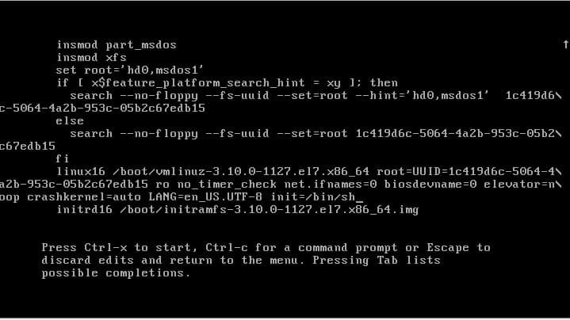
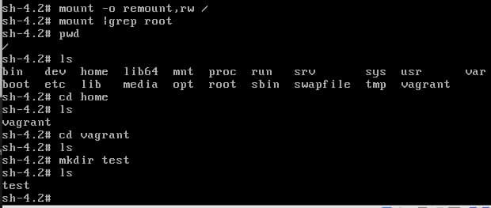
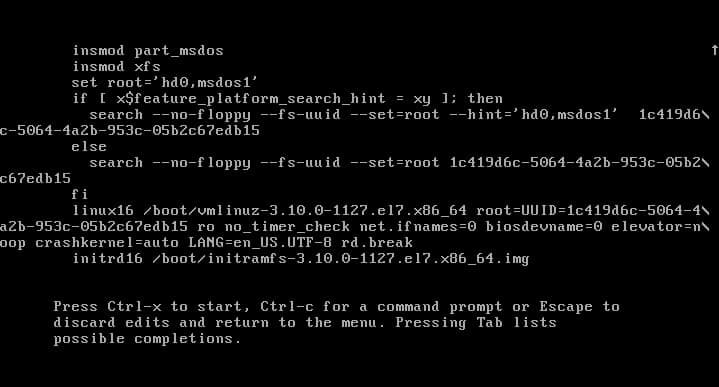

# OTUS. Занятие 5 - Загрузка системы

Задание:
```
Работа с загрузчиком
Попасть в систему без пароля несколькими способами
Установить систему с LVM, после чего переименовать VG
Добавить модуль в initrd
4(*). Сконфигурировать систему без отдельного раздела с /boot, а только с LVM Репозиторий с пропатченым grub: https://yum.rumyantsev.com/centos/7/x86_64/ PV необходимо инициализировать с параметром --bootloaderareasize 1m
Критерии оценки:
Описать действия, описать разницу между методами получения шелла в процессе загрузки. Где получится - используем script, где не получается - словами или копипастой описываем действия.
```

# Попасть в систему без пароля несколькими способами

- Способ 1. init=/bin/sh

Из GUI Virtualbox перезагружаю VM, при появлении меню выбора ядра нажимаю e(edit) и попадаю в окно изменения параметров загрузки.

- В конце строки, начинающейся с linux16, добавляю init=/bin/sh и удаляю строки console=tty0 console=ttyS0 во избежание Kernel Panic
- нажимаю сtrl-x для загрузки в системы



Система загрузилась, но рут смонтировался в RO. Исправляю



- Способ 2. rd.break

Из GUI Virtualbox перезагружаю VM, при появлении меню выбора ядра нажимаю e(edit) и попадаю в окно изменения параметров загрузки.

- В конце строки, начинающейся с linux16, добавляю rd.break
- нажимаю сtrl-x для загрузки в системы



Система загружается в Emergency mode. Монтирую ФС в RW и меняю пароль root

