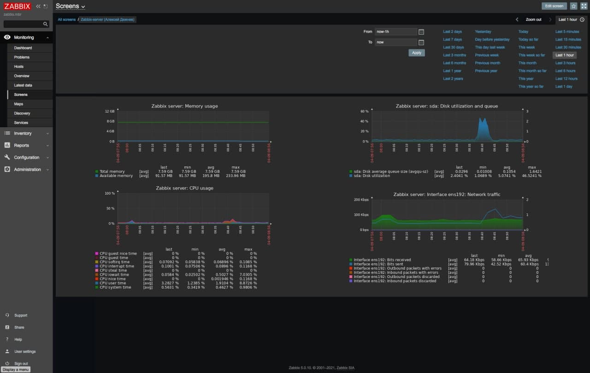

# OTUS. Занятие 5 - Загрузка системы

Задание:
```
Работа с загрузчиком
Попасть в систему без пароля несколькими способами
Установить систему с LVM, после чего переименовать VG
Добавить модуль в initrd
4(*). Сконфигурировать систему без отдельного раздела с /boot, а только с LVM Репозиторий с пропатченым grub: https://yum.rumyantsev.com/centos/7/x86_64/ PV необходимо инициализировать с параметром --bootloaderareasize 1m
Критерии оценки:
Описать действия, описать разницу между методами получения шелла в процессе загрузки. Где получится - используем script, где не получается - словами или копипастой описываем действия.
```


Настроен дашборд с 4-мя графиками в системе Zabbix 5.0 LTS
- память
- процессор
- диск
- сеть

Дашборд содержит имя студента

